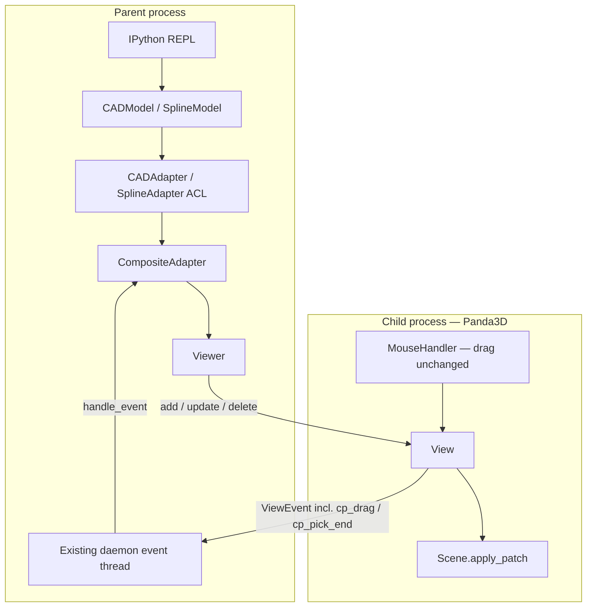
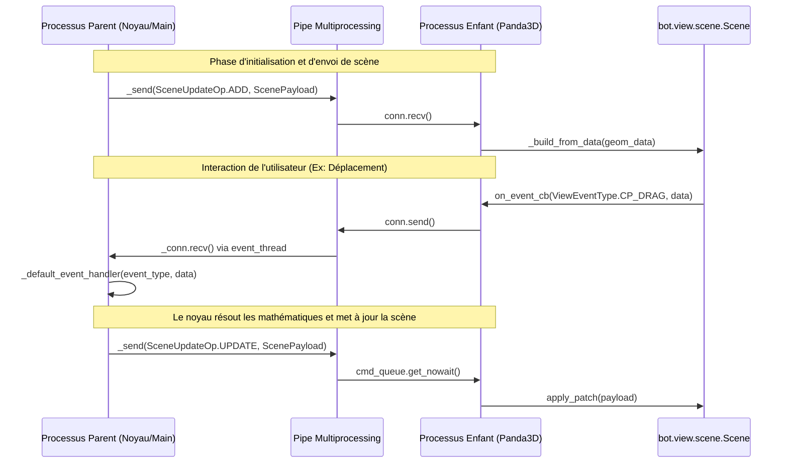
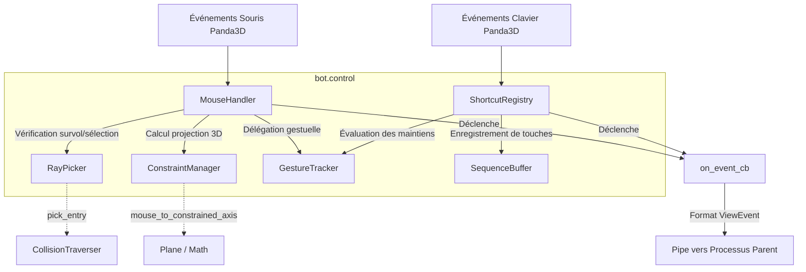
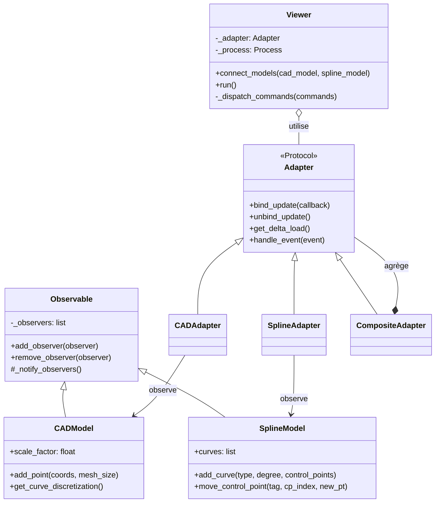
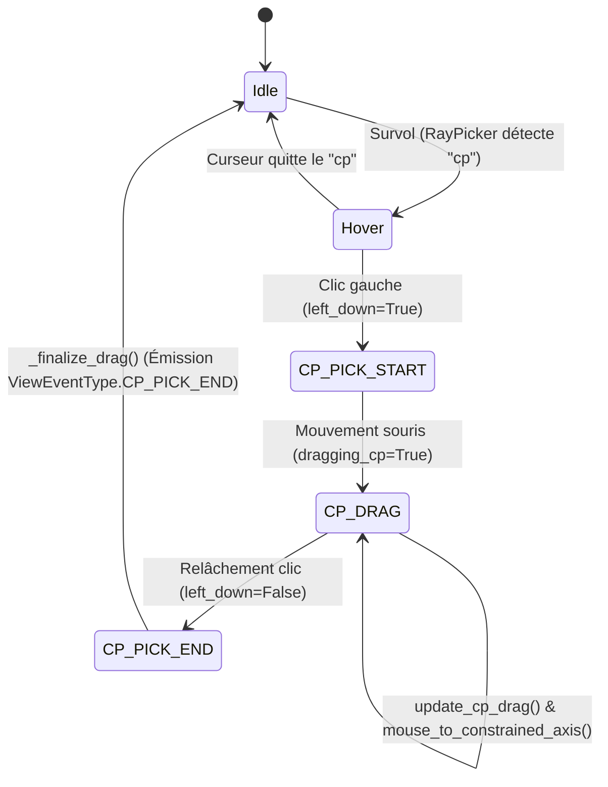
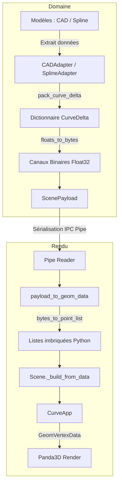

# Architecture and IPC Communication

To keep the Python REPL (e.g., IPython) fully interactive while maintaining a fluid 60 FPS 3D rendering pipeline, **bot** implements a split-process architecture. OpenGL and windowing contexts (Panda3D) run inside a dedicated subprocess, isolated from the mathematical calculations.

## Process Separation

1. **Parent Process (Main Process):**
   * Hosts your Python script or interactive REPL session.
   * Maintains the true mathematical models (`CADModel`, `SplineModel`).
   * Runs a background daemon thread to continuously listen for incoming data from the UI.
2. **Child Process (Subprocess):**
   * Runs the Panda3D application engine on its main thread (required for macOS/OpenGL stability).
   * Handles user input captures, camera matrices, and drawing loops.

## Events vs. Commands

Communication across the IPC Pipe is strictly divided into two distinct paradigms based on direction and intent:

### 1. View Events (`ViewEventType`)
* **Direction:** Child Process -> Parent Process.
* **Intent:** Notification of a physical interaction performed by the user inside the 3D window (e.g., a mouse click, hovering over a curve, or releasing a dragged control point).
* **Data structure:** Serializable dictionaries carrying interaction metadata (e.g., `curve_tag`, `world_pos`, `cp_index`).

### 2. Viewer Commands (`ViewerCommandType` & `SceneUpdateOp`)
* **Direction:** Parent Process -> Child Process.
* **Intent:** Imperative instructions forcing the 3D window to update its state or render new frames.
* **Categories:**
  * **Topology Operations (`SceneUpdateOp`):** Heavyweight actions to synchronize 3D structures (`ADD`, `UPDATE`, `DELETE`).
  * **Display State Commands (`ViewerCommandType`):** Lightweight UI adjustments (`HIGHLIGHT_CURVE`, `UPDATE_HUD`, `SET_EDIT_MODE`).

### Comparative Summary

| Feature | View Event | Viewer Command |
| :--- | :--- | :--- |
| **Origin** | Subprocess User Inputs | Parent Math Kernel/Script |
| **Destination** | Background Listener Thread | 3D Engine Command Queue |
| **Philosophy** | "Something happened in the canvas" | "Change your pixels right now" |
| **Heavy Payloads** | No (metadata coordinates only) | Yes (contains float32 byte buffers for geometry) |

---

---

---

---

