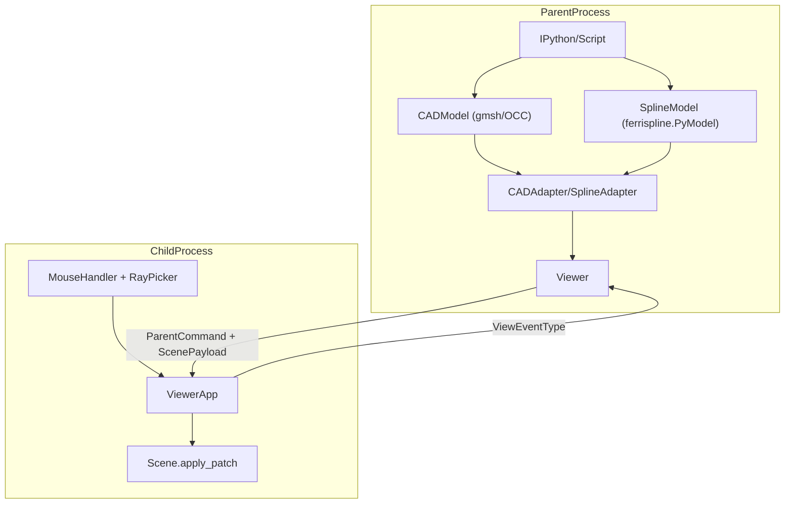

# BOT — Technical Reference V1

This document is the canonical technical reference for BOT V1.

- Audience: engineers and researchers working on Linux.
- Scope: architecture, runtime flow, raycasting, interactive API, and CI/CD.
- Source of truth: repository code (`bot/` package, workflows, and examples).

## Table of Contents

1. [System Overview](#1-system-overview)
2. [Getting Started](#2-getting-started)
3. [Core Mechanisms](#3-core-mechanisms)
4. [API Reference](#4-api-reference)
5. [Development and CI/CD](#5-development-and-cicd)

## 1. System Overview

BOT is a split-process interactive geometry environment:

- Parent process: Python session (IPython/script), CAD and spline models.
- Child process: Panda3D renderer and input handlers.
- IPC: typed command/event messages over `multiprocessing.Pipe`.



### Core components

| Layer | File(s) | Role |
|---|---|---|
| CAD kernel | `bot/core/cad.py` | `CADModel` wrapper around gmsh/OpenCASCADE |
| Spline kernel | `bot/core/spline.py` | `SplineModel` wrapper around `ferrispline.PyModel` |
| Observer base | `bot/core/observable.py` | Change notifications (`_notify_observers`) |
| Viewer API | `bot/viewer/viewer.py` | Subprocess lifecycle and event/command dispatch |
| IPC contracts | `bot/viewer/contracts.py` | `SceneUpdateOp`, `ViewerCommandType`, `ViewEventType`, payload types |
| ACL adapters | `bot/viewer/viewable.py` | `CADAdapter`, `SplineAdapter`, `CompositeViewable` |
| Rendering | `bot/view/scene.py`, `bot/view/curve_app.py` | Scene and curve primitives |
| Input/raycast | `bot/control/picker.py`, `bot/control/mouse.py` | Selection and drag logic |

### FerriSpline integration

`SplineModel` delegates spline computations to FerriSpline through `ferrispline.PyModel`:

- curve creation/evaluation in Rust-backed code,
- Python-side observer integration for viewer updates,
- visual control-point edits routed back to model mutations.

For FerriSpline internals, see [`ferrispline/docs/technical_reference_v1.md`](../ferrispline/docs/technical_reference_v1.md).

## 2. Getting Started

### Prerequisites

- Python >= 3.14
- `uv` for dependency management
- Linux OpenGL packages for headless runs:

```bash
sudo apt-get install libglu1-mesa libosmesa6
```

### Clone and install

```bash
git clone --recurse-submodules https://github.com/LIHPC-Computational-Geometry/bot.git
cd bot
uv sync --all-extras --dev
```

The `ferrispline` submodule is required and installed as a local dependency (`ferrispline/python`) via `pyproject.toml`.

### Minimal interactive run

```python
import bot
from bot.core.spline import SplineModel, BEZIER_TYP
from bot.viewer.contracts import ViewEventType

cad_model = bot.CADModel()
cad_model.open("data/profil_1.geo")

spline_model = SplineModel()
spline_model.add_curve(
    BEZIER_TYP,
    degree=3,
    control_points=[[0.0, 0.0, 0.0], [1.0, 3.0, 0.0], [4.0, 3.0, 0.0], [5.0, 0.0, 0.0]],
)

viewer = bot.Viewer()
viewer.connect_models(cad_model, spline_model).run()

viewer.add_callback(ViewEventType.CURVE_SELECTED, lambda tag: print("Selected:", tag))
```

See `main.ipy` for a fuller script.

### Test and documentation commands

```bash
uv run pytest
uv run pytest tests/unit/
uv run pytest tests/system/
uv run pdoc ./bot
uv run pdoc ./bot -o ./docs
```

## 3. Core Mechanisms

### 3.1 IPC and geometry transport

BOT uses `multiprocessing.Pipe` to exchange tuples `(cmd, data)`.

| Direction | Message family | Typical payload |
|---|---|---|
| Parent -> child | `SceneUpdateOp` / `ViewerCommandType` | `ScenePayload`, display command dict |
| Child -> parent | `ViewEventType` | event metadata dict (`curve_tag`, `cp_index`, `world_pos`) |

Geometry is serialized as packed float32 `bytes` channels in `CurveDelta`:

- `curve_vertices: bytes`
- optional `cp_vertices: bytes`
- `vertex_count`, `edges`, optional degree/CP metadata

Transport characteristics:

- Cross-process: pickled copy through Pipe.
- Child UPDATE path: `np.frombuffer` in `curve_app.py` for efficient decode after unpickle.
- ADD path: full scene build decodes payload into scene state.

### 3.2 Zero-copy positioning

The current system has layered copy behavior:

1. **FerriSpline compute side (same process)**: Rust->NumPy uses zero-copy transfer (`IntoPyArray`) in FerriSpline bindings.
2. **BOT IPC transport (cross process)**: payloads are pickle-copied; no shared-memory transport yet.
3. **Child-side decode**: update buffers are consumed via `np.frombuffer`, minimizing extra copies post-receive.

Design direction:

- A future shared-memory `DeltaPayload` style transport can remove Pipe copy overhead for large geometry buffers while preserving `ScenePayload` semantics.

### 3.3 Events vs commands

From `bot/viewer/contracts.py`:

- **SceneUpdateOp**: `ADD`, `UPDATE`, `DELETE`
- **ViewerCommandType**: `HIGHLIGHT_CURVE`, `UPDATE_HUD`, `SET_EDIT_MODE`, `SET_ACTIVE_CURVE`, `SET_AXIS_CONSTRAINT`, `EXIT`, `RELOAD_CONFIG`
- **ViewEventType**: `HOVER`, `CURVE_SELECTED`, `CP_PICK_START`, `CP_DRAG`, `CP_PICK_END`, `PICK`

Known constraints documented in code comments:

- `CP_DRAG` can be chatty over IPC at high frequency.
- Some UI state commands could be resolved locally in child process.
- `PICK` is defined but currently not emitted by `MouseHandler`.

See also: [architecture.md](architecture.md).

### 3.4 Raycasting and picking

Raycasting pipeline is implemented in:

- `bot/control/picker.py` (`RayPicker`)
- `bot/control/mouse.py` (`MouseHandler`)
- `bot/view/curve_app.py` (collision solids for curves/control points)
- `bot/math/constraints.py` (axis/plane constrained drag projection)

Flow:

1. Build collision geometry (`CollisionTube` for curves, `CollisionSphere` for control points).
2. Cast camera ray with `CollisionRay.setFromLens(...)`.
3. Traverse collisions and prioritize CP hits when needed.
4. Emit events:
   - hover -> `HOVER`
   - click curve -> `CURVE_SELECTED`
   - CP edit lifecycle -> `CP_PICK_START`, `CP_DRAG`, `CP_PICK_END`

### 3.5 Dirty invalidation and spline updates

`SplineModel` uses observer notifications (`_notify_observers`) to trigger adapter updates.
FerriSpline exposes `is_dirty` at model level; BOT currently relies on the observer stream rather than querying dirty state before every update.

## 4. API Reference

### 4.1 Interaction surface (no standalone CLI)

BOT provides a programmatic API:

- IPython sessions,
- Python scripts,
- direct package imports.

There is no dedicated command-line command in `pyproject.toml`.

### 4.2 `CADModel` (`bot/core/cad.py`)

Common methods:

| Method | Purpose |
|---|---|
| `initialize()` / `finalize()` | gmsh lifecycle |
| `open(filename)` | Load `.geo` or CAD shape file |
| `add_point(coords, mesh_size=1.0)` | Mutate model and notify observers |
| `get_point_tags()`, `get_curve_tags()`, `get_surface_tags()` | Entity queries |
| `get_end_points(curve_tag)` | Curve endpoints |
| `get_adjacent_curves_of_point(point_tag)` | Topology query |

### 4.3 `SplineModel` (`bot/core/spline.py`)

| Method | Purpose |
|---|---|
| `add_curve(type, degree, control_points, weights=None, knots=None)` | Create Bezier/NURBS curve |
| `remove_curve(tag)` | Delete curve |
| `_evaluate(tag, sample)` | Evaluate curve points |
| `get_control_points(curve_tag)` | Query control points |
| `get_degree(tag)` | Query degree |
| `move_control_point(tag, cp_index, new_pt)` | Commit control-point edits |
| `preview_evaluate(...)` | Stateless preview evaluation |

### 4.4 `Viewer` (`bot/viewer/viewer.py`)

| Method | Purpose |
|---|---|
| `connect_models(cad_model, spline_model=None)` | Connect model(s) via adapters |
| `disconnect()` | Unbind current viewable |
| `run()` / `stop()` | Start/stop child process |
| `add_callback(event_type, callback)` / `remove_callback(event_type)` | Event hooks |
| `highlight_curve(tag, color)` | Visual command |
| `set_hud_text(text)` | HUD text |
| `set_edit_mode(enabled, curve_tag=None)` | Edit mode |
| `set_active_curve(curve_tag)` | Programmatic active curve |
| `set_axis_constraint(mask)` | Constraint mask |
| `delete_curve(tag)` | Push delete payload |
| `move_control_point(curve_tag, cp_index, new_pos)` | Programmatic CP update |

### 4.5 Event payloads

Typed payloads are defined in `bot/viewer/contracts.py`:

- `EventHover`
- `EventCurveSelected`
- `EventCPPickStart`
- `EventCPDrag`
- `EventCPPickEnd`
- `EventPick`

Callbacks follow `Viewer.add_callback(ViewEventType.X, callback)`.

See also: [callbacks.md](callbacks.md).

### 4.6 Scene payload schema

Key transport structs:

- `ScenePayload`
- `CurveDelta`
- `CurveGeometry`

Use cases:

- `ADD`: initial scene load.
- `UPDATE`: partial curve patch.
- `DELETE`: remove curve tags.

### 4.7 Extension via `IViewable`

Custom model integration uses the adapter protocol (`IViewable`) in `bot/viewer/viewable.py`.

Core methods:

- `get_delta_load()`
- `update(model)`
- `handle_event(event)`

See the complete extension walkthrough in [custom_model.md](custom_model.md).

### 4.8 Keyboard shortcuts

From `bot/control/keyboard.py`:

- `c`: center camera
- `alt-x`, `alt-y`, `alt-z`: align camera plane
- `x`, `y`, `z`, `shift-x`, `shift-y`, `shift-z`, `0..7`: axis-constraint masks
- Arrow keys: smooth pan
- `f5`: hot reload
- `escape`: exit

## 5. Development and CI/CD

### Local workflow

```bash
uv sync --all-extras --dev
uv run pytest
uv run ruff check .
uv run ruff format --check .
```

### CI workflows

Defined in `.github/workflows/`:

- `tests.yml`
  - checkout with submodules,
  - install system OpenGL deps,
  - install Rust toolchain and cache ferrispline build artifacts,
  - run pytest with coverage.
- `lint.yml`
  - run Ruff lint and format checks.

### Test topology

- `tests/unit/`: isolated tests (no full viewer lifecycle).
- `tests/system/`: subprocess and end-to-end paths.

### Submodule workflow

When updating FerriSpline:

```bash
git submodule update --init --recursive
uv sync --all-extras --dev
```

### Documentation strategy

- Root `README.md`: onboarding and quick usage.
- `doc/index.md`: map of developer guides.
- Focused guides:
  - [architecture.md](architecture.md)
  - [callbacks.md](callbacks.md)
  - [custom_model.md](custom_model.md)
- This file: exhaustive reference.
