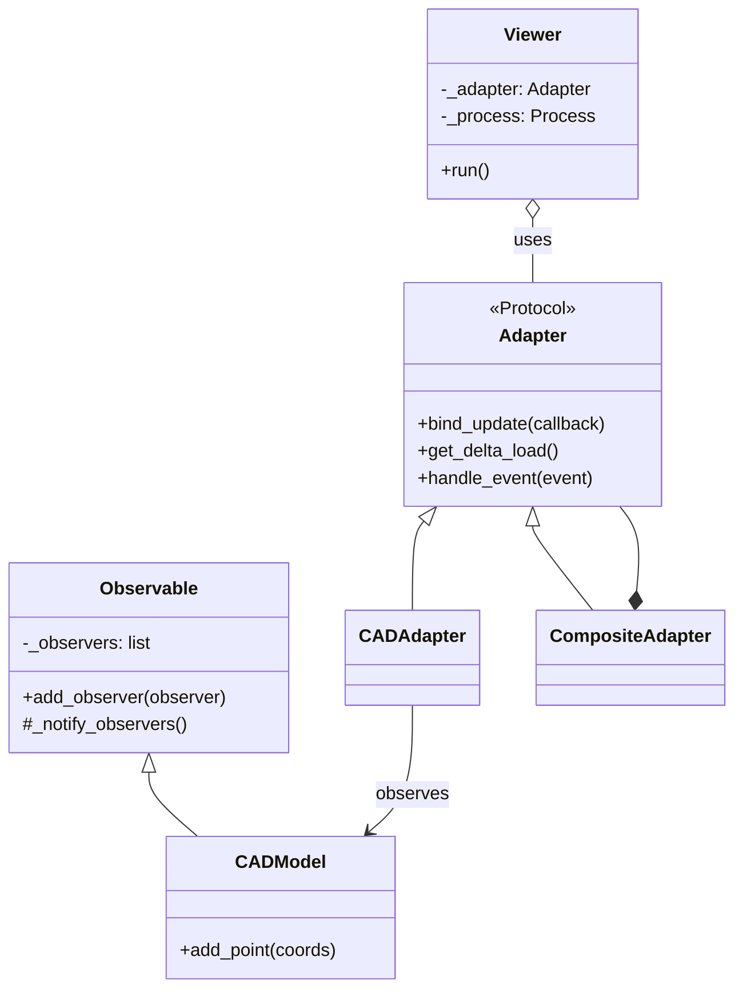

# Architecture and IPC Communication

To keep the Python REPL (e.g., IPython) fully interactive while maintaining a fluid 60 FPS 3D rendering pipeline, **BOT** implements a split-process architecture.

## Process Separation

1. **Parent Process (Main Process):**
   * Hosts your Python script or interactive REPL session.
   * Maintains the true mathematical models (`CADModel`, `SplineModel`).
   * Runs a background daemon thread to continuously listen for incoming data from the UI.
2. **Child Process (Subprocess):**
   * Runs the Panda3D application engine on its main thread (required for macOS/OpenGL stability).
   * Handles user input captures, camera matrices, and drawing loops.

## The Anti-Corruption Layer (ACL) and Observer Pattern

The core mathematical models (`bot.core`) are completely unaware of the 3D viewer. Instead, they inherit from an `Observable` class. When a geometric model changes, it notifies its observers.

The **Adapters** (`CADAdapter`, `SplineAdapter`, `CompositeAdapter`) act as these observers. They translate the mathematical state into a standardized `ScenePayload` and send it over the IPC pipe to the viewer.

## IPC: Events vs. Commands

Communication across the `multiprocessing.Pipe` is strictly divided by direction and intent:

### 1. View Events (`ViewEventType`)
* **Direction:** Child Process -> Parent Process.
* **Intent:** Notification of a physical interaction performed by the user inside the 3D window (e.g., clicking, dragging).
* **Data Structure:** Serializable dictionaries carrying interaction metadata (e.g., `curve_tag`, `world_pos`, `cp_index`).

### 2. Viewer Commands (`ViewerCommandType` & `SceneUpdateOp`)
* **Direction:** Parent Process -> Child Process.
* **Intent:** Imperative instructions forcing the 3D window to update its state or render new frames.
* **Categories:**
  * **`SceneUpdateOp`**: Heavy payloads for topology (`ADD`, `UPDATE`, `DELETE`).
  * **`ViewerCommandType`**: Lightweight UI adjustments (`HIGHLIGHT_CURVE`, `UPDATE_HUD`, `SET_EDIT_MODE`).

## Geometry Transport and Decoding Strategy

Transporting thousands of vertices between processes requires optimization to avoid serialization lag.

1. **Binary Serialization (Parent Side)**: Geometry is packed into contiguous `float32` byte arrays (e.g., `curve_vertices: bytes` inside `CurveDelta`) using `bot.viewer.serialize` before crossing the IPC pipe.
2. **Decoding (Child Side)**: The child process consumes these buffers efficiently via `np.frombuffer` in `curve_app.py`, minimizing extra copies post-receive and ensuring real-time rendering speeds.