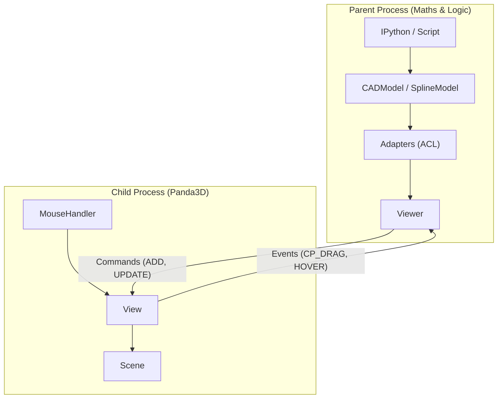
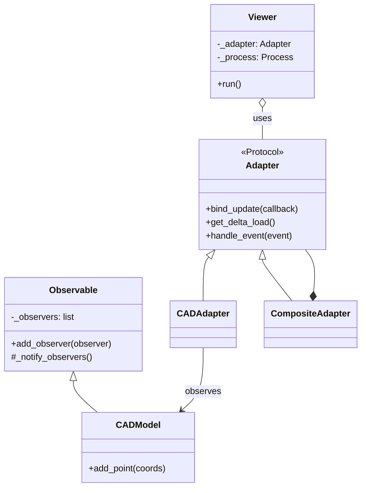
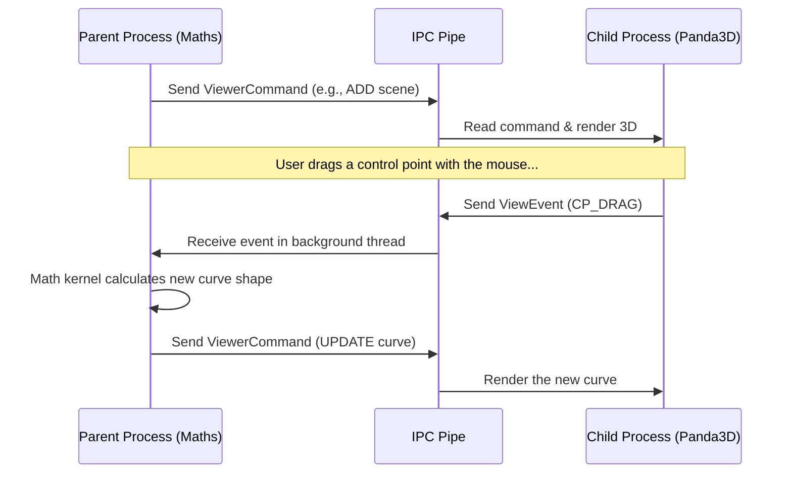
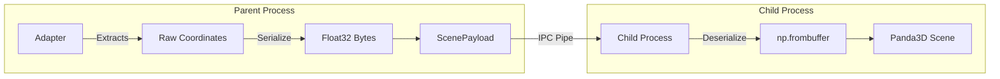

# Architecture and IPC Communication

To keep the Python REPL (e.g., IPython) fully interactive while maintaining a fluid 60 FPS 3D rendering pipeline, **BOT** implements a split-process architecture.

In this document, we will explore the different layers of this architecture using diagrams and simple explanations.

---

## 1. Process Separation

When you run **BOT**, you are actually running two separate programs (processes) that talk to each other. This is crucial because 3D rendering engines (like Panda3D) demand total control over the main thread to draw graphics smoothly. If we did heavy math on the same thread, the 3D window would freeze.

**How to read this diagram:**
* **Parent Process (Top):** This is where your code lives. It holds the pure mathematical models and the `Viewer` API. It doesn't know how to draw pixels; it only calculates data.
* **Child Process (Bottom):** This is the 3D window. It captures your mouse clicks (`MouseHandler`) and draws the 3D shapes (`Scene`), but it doesn't understand the complex math behind a CAD model.
* **The Arrows in the Middle:** The two processes communicate by passing messages back and forth through an invisible tube (the IPC Pipe).

---

## 2. The Anti-Corruption Layer (Observer Pattern)

To keep the code clean, the core mathematical models (`bot.core`) are completely unaware of the 3D viewer. They don't know what color a line should be or how to draw a point.

To bridge this gap, we use **Adapters**. They act as translators.

**How to read this diagram:**
* **Observable:** Our math models (`CADModel`, `SplineModel`) inherit from this. When a point is added, the model just shouts "I changed!" (`_notify_observers()`).
* **Adapters (`CADAdapter`, etc.):** They listen to the models. When they hear "I changed!", they grab the raw math data, translate it into a visual format (a `ScenePayload`), and hand it to the `Viewer`.
* **Viewer:** Takes the translated payload and sends it to the 3D child process.

---

## 3. The Communication Loop (Events vs. Commands)

Because our application is split into two processes, a user action (like dragging a point with the mouse) requires a fast "ping-pong" of messages to update the screen.

**How to read this diagram:**
1. **View Events (Child to Parent):** When the user drags a point, the Child Process says, *"The user moved their mouse here"* (`ViewEvent`). It does **not** try to calculate the new curve.
2. **Calculation:** The Parent Process receives the mouse coordinates, runs the complex FerriSpline math, and figures out exactly what the new curve should look like.
3. **Viewer Commands (Parent to Child):** The Parent Process sends back a command saying, *"Here are the new pixels to draw"* (`ViewerCommand`). The Child process simply updates the screen.

---

## 4. Geometry Transport and Serialization

Sending thousands of 3D coordinates (x, y, z) between two processes using standard Python lists would be very slow and cause lag. To maintain 60 FPS, we pack the data efficiently.

**How to read this diagram:**
* **Serialization (Left):** Before sending a curve to the viewer, the `Adapter` converts the list of numbers into a raw, compact block of memory (`Float32 Bytes`).
* **Deserialization (Right):** When the 3D process receives this block, it uses NumPy (`np.frombuffer`) to read it instantly without having to parse individual numbers. This allows us to update complex CAD models in real-time!